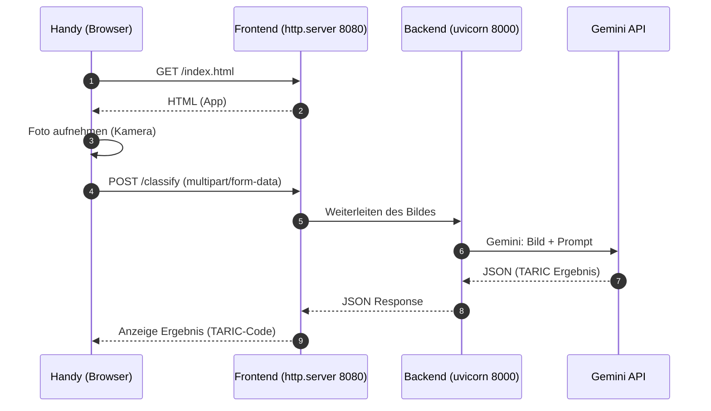
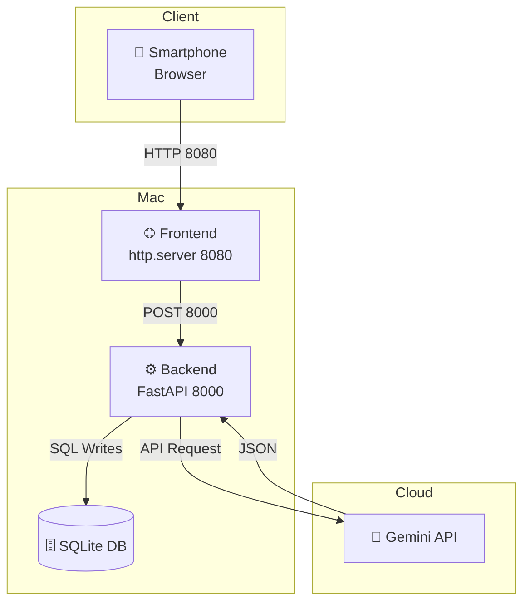
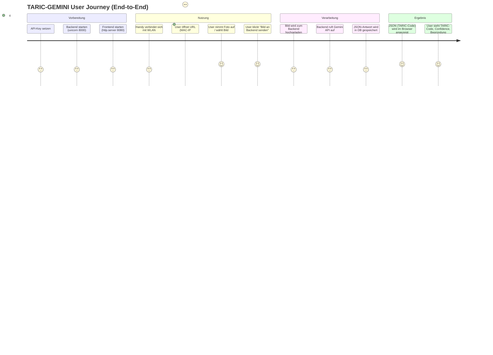
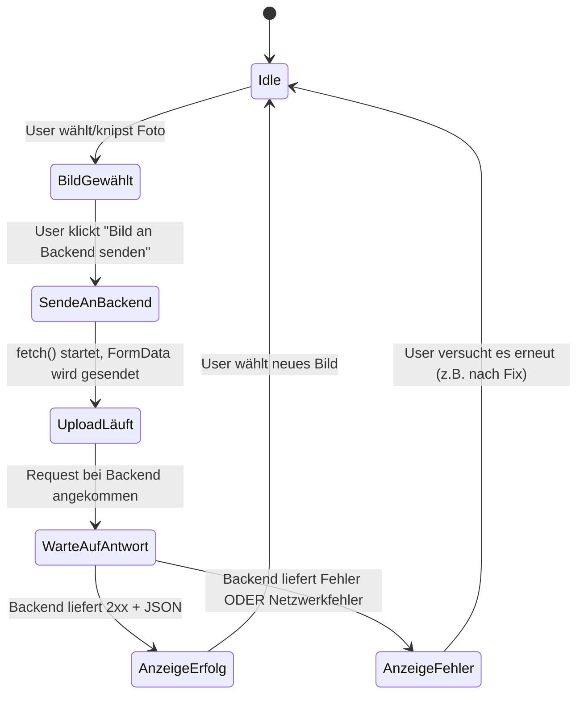
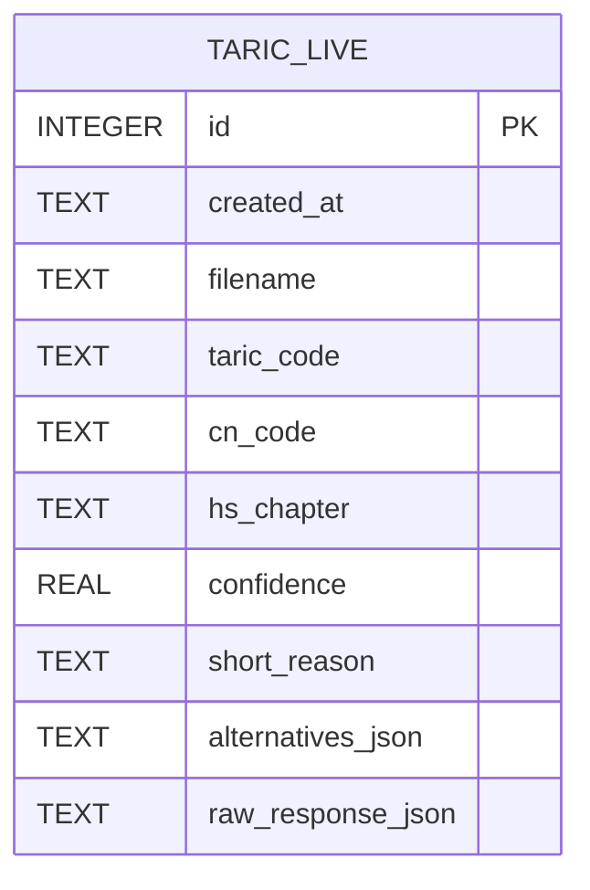
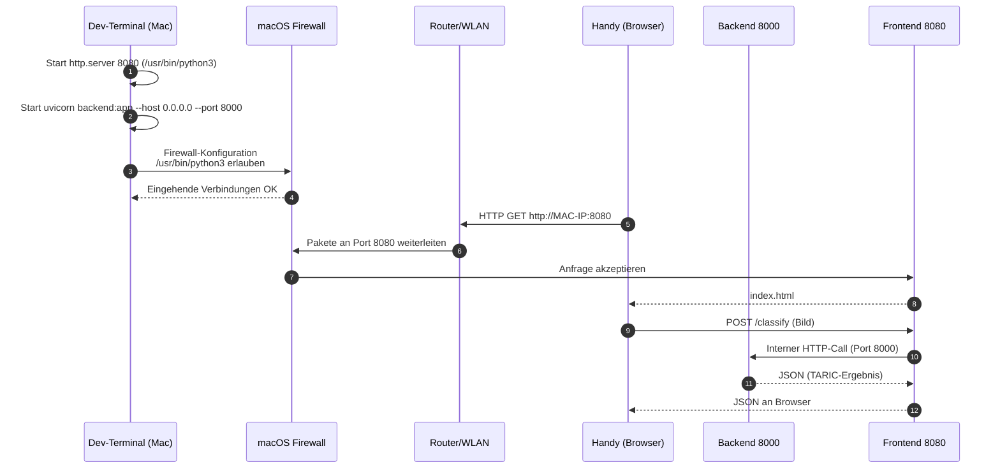
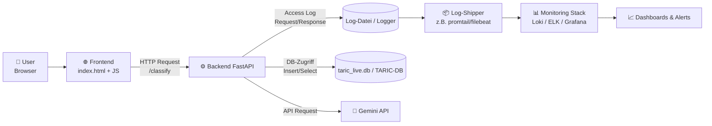
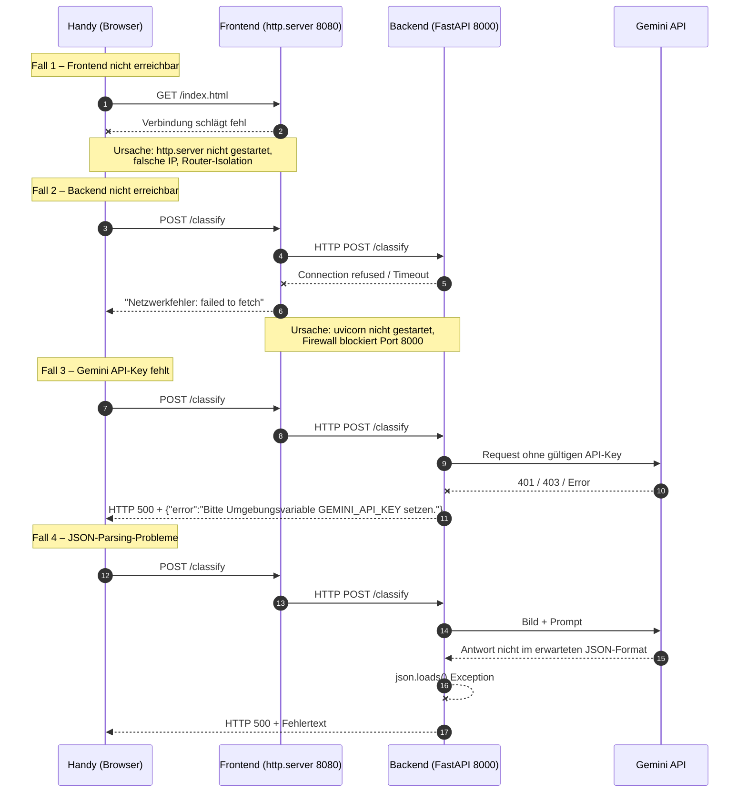
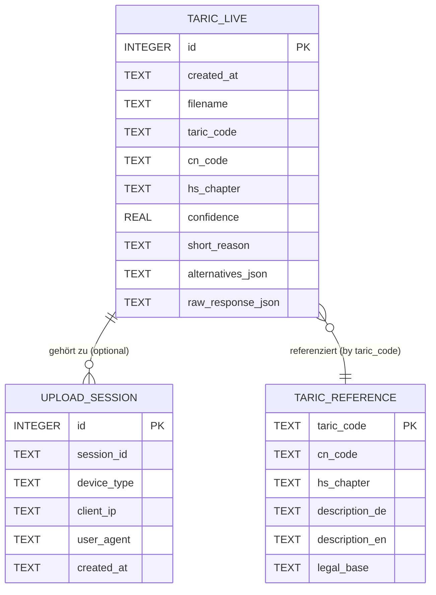

Unten erhältst du die **komplette, langfristige Vollversion** deiner Dokumentation – **optimiert für GitHub / README.md**, mit:

* farbigen Hinweisen über HTML-Panels
* sauberer Markdown-Strukur
* Tabellen
* klaren Schritt-für-Schritt Blöcken
* kill-Scripts, Test-Kommandos, Router-Checks
* Fehlerbildern & Ursachen
* dauerhaft verständlicher Architektur

Du kannst diese Datei **1:1 als `README.md` in dein Projekt übernehmen**.

---

# <div style="padding:12px;border-radius:8px;background:#0047AB;color:white;font-size:20px;font-weight:bold;">📘 TARIC-GEMINI – Vollständige Entwicklungs- & Betriebsdokumentation</div>

Diese Dokumentation beschreibt **jeden Schritt**, um dein TARIC-Gemini-System stabil zu starten, zu testen und monatelang später exakt zu reproduzieren.

Sie deckt alle Themen ab:

1. Projektstruktur
2. Server stoppen
3. Backend starten (uvicorn)
4. API-Key aktivieren
5. Frontend starten
6. Firewall konfigurieren
7. Router / AP-Isolation
8. Netzwerk-Tests
9. Handy-Tests
10. Fehlermeldungen & Ursachen
11. Kurzreferenz
12. Hilfsskripte (kill-scripts etc.)

---

# <div style="padding:12px;border-radius:8px;background:#EAEAEA;font-weight:bold;">1. Projektstruktur</div>

```
~/projects/taric-gemini/
│
├── backend.py              # FastAPI server
├── index.html              # Frontend Web-App (kamera + upload)
├── taric_live.db           # Live-Datenbank
├── taric_dataset.db        # TARIC-Stammdaten
├── bilder_uploads/         # gespeicherte Beispielbilder
├── .venv_taric/            # virtuelle Python-Umgebung
└── kill_http_servers.sh    # Hilfsskript zum stoppen alter Server
```

---

# <div style="padding:12px;border-radius:8px;background:#E5F5FF;font-weight:bold;">2. Hilfsskript – Alle Python-Webserver sauber beenden</div>

## Datei erstellen:

```bash
cd ~/projects/taric-gemini
nano kill_http_servers.sh
```

## Inhalt:

```bash
#!/bin/bash
echo "Suche nach laufenden Python-HTTP-Servern..."
PIDS=$(ps aux | grep "[p]ython" | grep "http.server" | awk '{print $2}')

if [ -z "$PIDS" ]; then
    echo "Keine laufenden Python-HTTP-Server gefunden."
    exit 0
fi

echo "Gefundene Serverprozess(e): $PIDS"
for PID in $PIDS; do
    echo "Beende Prozess PID $PID ..."
    kill "$PID" 2>/dev/null
    sleep 1
    if ps -p "$PID" > /dev/null; then
        echo "Prozess $PID läuft noch – sende KILL..."
        kill -9 "$PID" 2>/dev/null
    fi
done
echo "Alle Python-HTTP-Server wurden beendet."
```

Ausführbar machen:

```bash
chmod +x kill_http_servers.sh
```

---

# <div style="padding:12px;border-radius:8px;background:#FFF4E5;font-weight:bold;">3. Venv aktivieren</div>

```bash
cd ~/projects/taric-gemini
source .venv_taric/bin/activate
```

Erkennbar an:

```
(.venv_taric) qb@mac %
```

---

# <div style="padding:12px;border-radius:8px;background:#FFECEC;font-weight:bold;">4. GEMINI API-KEY aktivieren</div>

Den Key liest du automatisch aus einer Datei ein:

```bash
export GEMINI_API_KEY="$(cat API_GEMINI.txt)"
```

Test:

```bash
echo $GEMINI_API_KEY
```

---

# <div style="padding:12px;border-radius:8px;background:#D1FFE0;font-weight:bold;">5. Backend starten (FastAPI + uvicorn)</div>

```bash
uvicorn backend:app --reload --host 0.0.0.0 --port 8000
```

Wichtig:

| Parameter        | Bedeutung                    |
| ---------------- | ---------------------------- |
| `--host 0.0.0.0` | Zugriff aus dem LAN erlauben |
| `--reload`       | Hot-Reload beim Coden        |
| Port `8000`      | TARIC-API läuft hier         |

Backend erreichbar:

```
http://localhost:8000/docs
http://192.168.x.y:8000/docs
```

---

# <div style="padding:12px;border-radius:8px;background:#D1E8FF;font-weight:bold;">6. Frontend starten (http.server)</div>

**Nur `/usr/bin/python3` verwenden**, um Firewall-Probleme zu vermeiden.

```bash
/usr/bin/python3 -m http.server 8080 --bind 0.0.0.0
```

Frontend erreichbar:

```
http://localhost:8080/index.html
http://192.168.x.y:8080/index.html
```

---

# <div style="padding:12px;border-radius:8px;background:#FFF7C2;font-weight:bold;">7. Firewall-Konfiguration macOS</div>

macOS blockiert oft Python aus der venv.

### Vorgehen:

1.  → Systemeinstellungen
2. Datenschutz & Sicherheit
3. Firewall → Optionen
4. ALLE Python-Einträge löschen
5. Hinzufügen:

```
/usr/bin/python3
```

6. „Eingehende Verbindungen erlauben“ aktivieren
7. Firewall AUS → wieder EIN

---

# <div style="padding:12px;border-radius:8px;background:#FFD6D6;font-weight:bold;">8. IP-Adresse des Mac ermitteln</div>

```bash
ipconfig getifaddr en0
```

Beispiel:

```
192.168.7.124
```

Diese IP nutzt du im Handy.

---

# <div style="padding:12px;border-radius:8px;background:#E5FFE5;font-weight:bold;">9. Verbindungstests (lokal & remote)</div>

## Frontend

```bash
curl -v http://localhost:8080/index.html | head
curl -v http://192.168.7.124:8080/index.html | head
```

## Backend

```bash
curl -v http://192.168.7.124:8000/docs
```

---

# <div style="padding:12px;border-radius:8px;background:#E8E8E8;font-weight:bold;">10. Handy-Test (WLAN)</div>

> **Mobile Daten AUS**
> **Gleiches WLAN wie der Mac**
> **Keine Gastzelle / kein Captive Portal**

Im Handy-Browser:

```
http://192.168.7.124:8080
```

Wenn es nicht lädt → Router-Isolation.

---

# <div style="padding:12px;border-radius:8px;background:#FFEBEB;font-weight:bold;">11. Router-Konfiguration: AP-Isolation deaktivieren</div>

Suchen nach Begriffen:

| Begriff im Router  | Bedeutung                           |
| ------------------ | ----------------------------------- |
| AP Isolation       | WLAN-Geräte können sich nicht sehen |
| Client Isolation   | gleiche Funktion                    |
| Wireless Isolation | blockiert Peer-to-Peer              |
| Guest Mode         | kein Zugriff auf LAN-Geräte         |

**Diese Einstellung MUSS AUS sein.**

---

# <div style="padding:12px;border-radius:8px;background:#FFF4E5;font-weight:bold;">12. Fehlerbilder & Ursachen</div>

### 🟥 **Error: "Empty reply from server"**

Ursache:

* Firewall blockiert
* Router trennt Verbindung

### 🟥 **Netzwerkfehler: failed to fetch**

Ursache:

* Frontend spricht falsche URL an
* Backend nicht erreichbar
* Handy nicht im selben WLAN
* CORS falsch

### 🟥 **OSError 57: Socket not connected**

Ursache:

* Anfrage kommt an
* Router trennt sie sofort (AP Isolation)

### 🟥 **localhost geht, IP geht nicht**

Ursache:

* Firewall-Einstellung falsch
* oder Router blockiert lokale Geräte

---

# <div style="padding:12px;border-radius:8px;background:#E2F7FF;font-weight:bold;">13. Kurzreferenz – kompletter Workflow</div>

```bash
cd ~/projects/taric-gemini
./kill_http_servers.sh

source .venv_taric/bin/activate
export GEMINI_API_KEY="$(cat API_GEMINI.txt)"

uvicorn backend:app --reload --host 0.0.0.0 --port 8000
```

Neues Terminal:

```bash
/usr/bin/python3 -m http.server 8080 --bind 0.0.0.0
```

Tests:

```bash
ipconfig getifaddr en0
curl -v http://192.168.7.124:8080/index.html | head
curl -v http://192.168.7.124:8000/docs
```

Handy:

```
http://192.168.7.124:8080
```

---

# <div style="padding:12px;border-radius:8px;background:#C2FFE3;font-weight:bold;">14. GitHub-Kompatible Panels / Boxen</div>

Du kannst diese Panels überall in deinem README nutzen:

### Info-Box

```html
<div style="padding:10px;background:#E8F4FF;border-left:5px solid #2F80ED;">
<b>Info:</b> Text hier.
</div>
```

### Warnung

```html
<div style="padding:10px;background:#FFECEC;border-left:5px solid #D8000C;">
<b>Achtung:</b> Text hier.
</div>
```

### Erfolg

```html
<div style="padding:10px;background:#E8FFEF;border-left:5px solid #27AE60;">
<b>OK:</b> Text hier.
</div>
```

---

# <div style="padding:12px;border-radius:8px;background:#0047AB;color:white;font-weight:bold;">ARCHITEKTUR</div>

Hier findest du **zusätzliche, GitHub-kompatible Diagramme** in zwei Varianten:

1. **ASCII-Architekturdiagramme** (funktioniert überall, auch in README.md)
2. **Mermaid-Diagramme** (GitHub rendert Mermaid automatisch → ideal für Repos)


---

# <div style="padding:12px;border-radius:8px;background:#0047AB;color:white;font-size:20px;font-weight:bold;">📦 ARCHITEKTUR- DIAGRAMME (ASCII + MERMAID)</div>

---

# **1. System-Architektur (ASCII)**

```
 ┌──────────────────────────────────────────────────────────────────┐
 │                           TARIC-GEMINI                           │
 └──────────────────────────────────────────────────────────────────┘

 ┌───────────────┐                WLAN / LAN               ┌────────────────┐
 │   SMARTPHONE   │  http://MAC-IP:8080/index.html         │      MAC       │
 │ - Kamera       │ ─────────────────────────────────────▶ │ - Frontend     │
 │ - Browser      │                                          │   http.server│
 └───────┬───────┘                                          │   Port 8080   │
         │                                                   │              │
         │                                                   │ - Backend    │
         │ POST /classify                                    │   FastAPI    │
         └────────────────────────────────────────────────▶ │   Uvicorn     │
                                                             │   Port 8000  │
                                                             └───────┬──────┘
                                                                     │
                                                                     ▼
                                                         ┌────────────────────┐
                                                         │ Gemini API (Cloud) │
                                                         │  - Bildanalyse     │
                                                         │  - JSON-Output     │
                                                         └────────────────────┘

```

---

# **2. Netzwerkfluss (ASCII Sequenzdiagramm)**

```
HANDY                         FRONTEND                BACKEND               GEMINI
 |                               |                       |                    |
 |--- HTTP GET /index.html ----▶ |                       |                    |
 |                               |                       |                    |
 |<---------- HTML --------------|                       |                    |
 |                               |                       |                    |
 |--- Upload File via POST ----▶ |                       |                    |
 |       /classify               |                       |                    |
 |                               |--- POST /classify --->|                    |
 |                               |                       |--- API-Call ----▶ |
 |                               |                       |                    |
 |                               |                       |◀--- JSON ---------|
 |                               |<----- JSON Response---|                    |
 |<----------- TARIC JSON -------|                       |                    |
```

---

# <div style="padding:12px;border-radius:8px;background:#0047AB;color:white;font-weight:bold;">📘 MERMAID-DIAGRAMME (für GitHub optimiert)</div>

GitHub zeigt Mermaid automatisch an.
Du musst nur Folgendes einfügen:

---

# **3. Architektur (Mermaid Flowchart)**

```mermaid
flowchart LR
    A[📱 Smartphone<br/>Browser + Kamera] 
        -- http://MAC_IP:8080 --> 
    B[🌐 Frontend<br/>Python http.server<br/>Port 8080]

    B -- POST /classify --> C[⚙️ Backend<br/>FastAPI (uvicorn)<br/>Port 8000]

    C -- API Request --> D[🤖 Gemini API<br/>Bild + Prompt]

    D -- JSON Response --> C
    C -- JSON --> B
    B -- JSON --> A
```

---

# **4. Netzwerksequenz (Mermaid Sequence Diagram)**



---

# **5. Komponenten & Ports (Mermaid Architecture Grid)**



---

# <div style="padding:12px;border-radius:8px;background:#E8F4FF;border-left:6px solid #2F80ED;">💡 Hier sind zusätzliche Diagramme, damit du das System wirklich in- und auswendig verstehst.</div>

Diese Diagramme decken **Entwicklung, Netzwerk & API-Fluss** ab.


---

## 1. Gesamtüberblick: User Journey (Mermaid Journey Diagram)



Dieses Diagramm ist gut für Präsentationen: Zeigt klar, wo der Mensch im Prozess sitzt.

---

## 2. Deployment-Architektur (Dev / Future Prod)

### ASCII-Variante

```
┌───────────────────────────────────────────────┐
│                 LOKALE ENTWICKLUNG           │
│  (MacBook, Heimnetz, Handy im selben WLAN)   │
└───────────────────────────────────────────────┘

[Developer] ─── tippt Code in VS Code / Terminal

Mac:
  - .venv_taric (Python Umgebung)
  - backend.py (FastAPI, uvicorn Port 8000)
  - index.html + http.server (Port 8080)
  - SQLite: taric_live.db, taric_dataset.db

Smartphone:
  - Browser greift auf http://MAC-IP:8080 zu


Später mögliche PROD-Variante (high level):

Internet
  │
  ▼
Reverse Proxy (Nginx/Traefik)
  │
  ├── /api  ──▶ Container / VM mit FastAPI + DB
  └── /app  ──▶ Static Files (index.html, JS, CSS)
```

### Mermaid-Variante

```mermaid
flowchart TB
    subgraph LocalDev[Lokale Entwicklung (Mac + Handy)]
        Dev[👨‍💻 Developer<br/>VS Code, Terminal]
        Mac[💻 Mac<br/>Backend + Frontend + DB]
        Phone[📱 Smartphone<br/>Browser im WLAN]

        Dev --> Mac
        Phone -->|HTTP 8080| Mac
    end

    subgraph FutureProd[Optionale spätere PROD-Architektur]
        RP[🌐 Reverse Proxy<br/>Nginx/Traefik]
        API[⚙️ FastAPI Service<br/>Docker/VM]
        WEB[📄 Static Files<br/>CDN / Webserver]
        DB[(🗄️ Datenbank<br/>z.B. PostgreSQL/SQLite)]

        RP --> API
        RP --> WEB
        API --> DB
    end

    Mac -. Konzept .-> FutureProd
```

---

## 3. Fehlerfluss: Wo kann es schiefgehen? (Error Flow)

```mermaid
flowchart TD
    A[📱 User klickt<br/>"Bild an Backend senden"] --> B[POST /classify<br/>vom Handy an MAC-IP:8080]
    B --> C{Kann Frontend<br/>erreicht werden?}

    C -- Nein --> C1[❌ Fehler: "Seite nicht erreichbar"<br/>Ursachen:<br/>• http.server nicht gestartet<br/>• Falsche IP<br/>• AP-Isolation Router]
    C -- Ja --> D[Frontend leitet Request<br/>per fetch an Backend 8000]

    D --> E{Kann Backend 8000<br/>erreicht werden?}
    E -- Nein --> E1[❌ Fehler: "NetworkError / failed to fetch"<br/>Ursachen:<br/>• uvicorn nicht gestartet<br/>• Firewall blockiert Port 8000<br/>• Falscher Hostname]
    E -- Ja --> F[Backend verarbeitet Upload<br/>+ ruft Gemini API]

    F --> G{Gemini API Antwort OK?}
    G -- Nein --> G1[❌ Fehler im Backend-JSON / Exception<br/>Ursachen:<br/>• GEMINI_API_KEY fehlt/ungültig<br/>• Rate-Limits, API-Fehler]
    G -- Ja --> H[Backend speichert Ergebnis in DB<br/>und sendet JSON zurück]

    H --> I[Frontend zeigt JSON<br/>TARIC-Code + Confidence]
```

---

## 4. Zustandsautomat: Lebenszyklus eines Requests



Dieser Automat hilft sehr gut, um später z. B. Logging- und Fehlerbehandlung gezielt auf die Zustände zu legen.

---

## 5. Datenfluss / Logging / Persistenz

### Mermaid-Datenfluss

```mermaid
flowchart LR
    U[📱 User] --> F[🌐 Frontend<br/>index.html + JS]
    F -->|FormData (Bild)| B[⚙️ Backend /classify]

    B -->|Speichert Bilddatei| IMG_DIR[(📂 bilder_uploads/)]
    B -->|Schreibt Ergebnis| DB[(🗄️ taric_live.db)]

    B -->|API-Call mit Bildbytes + Prompt| G[🤖 Gemini API]
    G -->|JSON Output| B

    B -->|JSON Response| F
    F -->|Formatierte Anzeige| U
```

---

## 6. ER-/Datenmodell deiner taric_live.db (vereinfachtes ERD)



Erweiterungsideen:

* Tabelle `taric_reference` → Referenzdaten der TARIC-Nomenklatur
* Tabelle `uploads` → Metadaten je Upload (User, Device, etc.)
* Tabelle `logs` → technische Logs, Fehler, Response-Zeiten

---

## 7. Sequenz inkl. Firewall & Router-Checks (Technische Sicht)



---

## 8. Diagramm der Start-Skripte & Workflows

```mermaid
flowchart TB
    A[🔧 Entwickler öffnet Terminal] --> B[./kill_http_servers.sh]
    B --> C[source .venv_taric/bin/activate]
    C --> D[export GEMINI_API_KEY=$(cat API_GEMINI.txt)]
    D --> E[uvicorn backend:app --host 0.0.0.0 --port 8000]

    E --> F[/usr/bin/python3 -m http.server 8080 --bind 0.0.0.0]

    F --> G[🏁 System bereit für Handy & Desktop]
```

---

```md
<div style="padding:12px;border-radius:8px;background:#0047AB;color:white;font-size:20px;font-weight:bold;">
📦 Deployment-Architektur (Dev / Staging / Prod)
</div>
```

Nachfolgend eine erweiterbare Architektur, die von deinem heutigen Setup (lokaler Mac) zu einer möglichen Staging-/Produktivumgebung führt.

### 1.1 Überblick (Mermaid)

```mermaid
flowchart TB
    subgraph Dev[Lokale Entwicklung (Mac + Handy im WLAN)]
        DEV_MAC[💻 Mac<br/>FastAPI + http.server<br/>SQLite]
        DEV_PHONE[📱 Handy / Browser]
        DEV_PHONE -->|HTTP 8080| DEV_MAC
    end

    subgraph Staging[Staging-Umgebung (z.B. VM oder Docker Host)]
        ST_RP[🌐 Reverse Proxy<br/>Nginx/Traefik]
        ST_API[⚙️ FastAPI Container<br/>Gunicorn/Uvicorn]
        ST_WEB[📄 Statisches Frontend<br/>index.html, JS, CSS]
        ST_DB[(🗄️ DB<br/>SQLite/PostgreSQL)]

        ST_RP -->|/api| ST_API
        ST_RP -->|/app| ST_WEB
        ST_API --> ST_DB
    end

    subgraph Prod[Produktiv-Umgebung]
        PRX[🌐 Reverse Proxy / Load Balancer]
        S1[⚙️ API-Server 1]
        S2[⚙️ API-Server 2]
        PWEB[📄 Frontend (CDN/Webserver)]
        PDB[(🗄️ Produktiv-DB)]
        LOG[📊 Logging / Monitoring]
        PRX --> S1
        PRX --> S2
        PRX --> PWEB
        S1 --> PDB
        S2 --> PDB
        S1 --> LOG
        S2 --> LOG
    end

    Dev -. Konzept .-> Staging
    Staging -. Rollout .-> Prod
```

### 1.2 Staging/Prod – typische Rollen

| Ebene      | Komponente                      | Aufgabe                                        |
| ---------- | ------------------------------- | ---------------------------------------------- |
| Netzwerk   | Reverse Proxy / Load Balancer   | TLS, Routing, Ratenbegrenzung, Logging         |
| API        | FastAPI-Container               | Endpunkte `/classify`, `/health`, spätere APIs |
| Frontend   | Static Hosting / CDN            | `index.html`, JS, CSS                          |
| Datenbank  | SQLite / PostgreSQL             | Ergebnisse, TARIC-Referenzen                   |
| Monitoring | Loki / Promtail / ELK / Grafana | Logs, Metriken, Alerting                       |

---

```md
<div style="padding:12px;border-radius:8px;background:#1B5E20;color:white;font-size:20px;font-weight:bold;">
📊 Logger & Monitoring-Fluss
</div>
```

Ziel: Verstehen, wie Logs von Handy bis in ein zentrales Monitoring-System wandern könnten.

### 2.1 Log- / Monitoring-Fluss (Mermaid)



### 2.2 Was loggen?

Typische Log-Dimensionen:

* **Request-Infos:** Pfad (`/classify`), HTTP-Methode, Statuscode, Dauer, Payload-Größe
* **Technisches:** Exceptions, Stacktraces, Timeout-Fehler, API-Fehler von Gemini
* **Fachliches:** TARIC-Code, Confidence, Art der Ware (nur in anonymisierter Form)

Beispiel-Pseudo-Log-Format (JSON):

```json
{
  "time": "2025-11-26T21:15:30Z",
  "level": "INFO",
  "module": "backend.classify",
  "client_ip": "192.168.7.55",
  "endpoint": "/classify",
  "status_code": 200,
  "duration_ms": 842,
  "taric_code": "9018908500",
  "confidence": 0.95
}
```

---

```md
<div style="padding:12px;border-radius:8px;background:#E65100;color:white;font-size:20px;font-weight:bold;">
⚠️ Sequence Diagramm für Fehlerfälle
</div>
```

Hier ein Sequenzdiagramm, das häufige Fehlerquellen abbildet (CORS, Firewall, API-Key, Router).

### 3.1 Fehlerfälle – Sequenz (Mermaid)



### 3.2 Typische Gegenmaßnahmen

* **Frontend-Fehler:** prüfen `http.server`, IP, Router AP-Isolation
* **Backend-Fehler:** `uvicorn` läuft? Port richtig? Firewall erlaubt?
* **API-Key-Fehler:** `export GEMINI_API_KEY="$(cat API_GEMINI.txt)"`
* **JSON-Fehler:** robustere Fehlerbehandlung (try/except) und Logging

---

```md
<div style="padding:12px;border-radius:8px;background:#6A1B9A;color:white;font-size:20px;font-weight:bold;">
🗄️ ER-Diagramm der TARIC-Datenbank
</div>
```

Aktuell nutzt du eine Tabelle `taric_live`. Für ein ausbaufähiges System lohnt sich ein kleines **logisches Datenmodell**, in dem:

* TARIC-Referenzdaten getrennt sind
* Klassifikationsergebnisse referenzieren diese
* optional Nutzer / Sessions erfasst werden

### 4.1 Vereinfachtes ERD (Mermaid)



### 4.2 Mögliche Tabellen im Detail

#### Tabelle: `taric_live`

| Spalte              | Typ     | Beschreibung                       |
| ------------------- | ------- | ---------------------------------- |
| `id`                | INTEGER | Primärschlüssel                    |
| `created_at`        | TEXT    | Zeitstempel (UTC oder lokale Zeit) |
| `filename`          | TEXT    | lokaler Bild-Dateiname             |
| `taric_code`        | TEXT    | vom Modell vorgeschlagener Code    |
| `cn_code`           | TEXT    | korrespondierender CN-Code         |
| `hs_chapter`        | TEXT    | z.B. „90“ für Kapitel 90           |
| `confidence`        | REAL    | Modell-Sicherheitswert (0.0–1.0)   |
| `short_reason`      | TEXT    | Kurzbegründung                     |
| `alternatives_json` | TEXT    | weitere mögliche Codes (JSON)      |
| `raw_response_json` | TEXT    | komplette Roh-Antwort des Modells  |

#### Tabelle: `taric_reference`

| Spalte           | Typ  | Beschreibung                      |
| ---------------- | ---- | --------------------------------- |
| `taric_code`     | TEXT | Primärschlüssel, 10-stellig       |
| `cn_code`        | TEXT | zugehöriger 8-stelliger Code      |
| `hs_chapter`     | TEXT | HS-Kapitel (2-stellig)            |
| `description_de` | TEXT | deutsche Bezeichnung              |
| `description_en` | TEXT | englische Bezeichnung             |
| `legal_base`     | TEXT | ggf. Verweis auf Rechtsgrundlagen |

#### Tabelle: `upload_session` (optional)

| Spalte        | Typ     | Beschreibung                                   |
| ------------- | ------- | ---------------------------------------------- |
| `id`          | INTEGER | Primärschlüssel                                |
| `session_id`  | TEXT    | generierter Key pro Nutzer-Sitzung             |
| `device_type` | TEXT    | z.B. „mobile“, „desktop“                       |
| `client_ip`   | TEXT    | IP-Adresse (lokal/öffentlich – Vorsicht DSGVO) |
| `user_agent`  | TEXT    | Browser-/Gerätekennung                         |
| `created_at`  | TEXT    | Zeitstempel                                    |

---

Wenn du möchtest, kann ich im nächsten Schritt:

* aus diesem ERD **konkrete SQL `CREATE TABLE`-Statements** generieren (SQLite/PostgreSQL),
* oder eine separate Datei `docs/architecture.md` fertig bauen, in der **alle Diagramme gesammelt** sind und aus dem `README.md` nur verlinkt werden.


